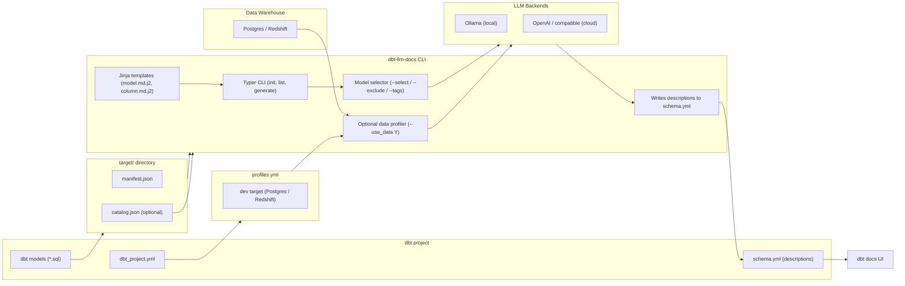

# dbt-llm-docs

A powerful CLI tool that generates **LLM-powered documentation** for dbt models and columns and writes them directly into your `schema.yml` so the results appear in `dbt docs serve`.

This CLI uses Jinja2 prompt templates plus a pluggable LLM backend (Ollama or OpenAI).  
Optionally, it can connect to your **actual warehouse** (Postgres & Redshift today) and profile real data to give the LLM deeper context for column descriptions.

---

## 🚀 Features

### ✅ 1. LLM-generated model + column documentation  
Produces rich, clear Markdown text suitable for dbt docs.  
Descriptions are written directly into `schema.yml`.

### ✅ 2. Customizable Jinja2 prompt templates  
Located in `<project>/prompts/`.  
You can fully customize the writing style, voice, or structure.

### ✅ 3. dbt-aware selection  
Supports:
- `--select`
- `--exclude`
- `--tags`
- Glob-like patterns (`stg_*`, `marts.*`)
- Parent/child expansion (`+model_name`)

### ✅ 4. Data-aware documentation (`--use_data Y`)  
When enabled, the tool:

1. Reads database connection info **from `profiles.yml`**  
2. Connects to the warehouse (**Postgres & Redshift** supported today)  
3. Executes the model’s compiled SQL  
4. Samples rows and computes:  
   - Missing %  
   - Unique %  
   - Min / Max  
   - Mean / Std  
   - Example values  
5. Passes these stats to the LLM for smarter, context-rich documentation  
6. Appends a Markdown statistics table under each column description in dbt Docs

> 🛠️ **Support for more databases (Snowflake, BigQuery, Databricks)** is coming soon.

---

## 🔒 Data Privacy Note

If `--use_data Y` is enabled, the *profile summary* (NOT raw data) is sent to the selected LLM backend.

If your organization forbids sending data outside the network, you should use:

```
dbt-llm-docs llm-docs-generate --backend ollama
```

Because **Ollama runs 100% locally**, ensuring no prompts or data ever leave your machine.

---


## 🧱 Architecture Overview



> ### ⚠️ Important: Requires a Compiled dbt Project
> `dbt-llm-docs` depends on dbt’s generated artifacts.  
> Before running this tool, your dbt project **must be compiled** and the following files must exist in your `target/` directory:
>
> - `manifest.json` — required  
> - `catalog.json` — optional but recommended for accurate column types  
>
> Generate them using:
>
> ```bash
> dbt docs generate
> ```
>
> If these artifacts are missing, the tool cannot discover models, columns, SQL, or metadata needed for documentation.

## 🤖 Installing Ollama (Recommended for Privacy)

### macOS / Linux

```bash
curl -fsSL https://ollama.com/install.sh | sh
```

Run Ollama:

```bash
ollama serve
```

Download a model:

```bash
ollama pull llama3.1
```

### Windows (WSL recommended)

Refer to: https://ollama.com/download

---

## 📦 Installation

```bash
git clone <your-repo>
cd dbt-llm-docs

python -m venv .venv
source .venv/bin/activate
pip install -e .
```

Requires:

- `manifest.json` (run `dbt docs generate`)
- Optionally `catalog.json` for column types

---


## ⚙️ Environment Variables

To avoid passing arguments repeatedly, you can set environment variables:

```bash
# Ollama (local)
export OLLAMA_HOST="http://ubuntu-pc.local:11434"
export OLLAMA_MODEL="llama3.1:8b-instruct-q8_0"
export TEMPERATURE=0.2

# (Future) OpenAI or compatible APIs
export OPENAI_BASE_URL="https://api.openai.com/v1"
export OPENAI_MODEL="gpt-4o-mini"
export OPENAI_API_KEY="sk-..."
```

## 🔧 Usage

### Initialize templates

```bash
dbt-tools init --project-dir .
```

### List models

```bash
dbt-tools  list --project-dir . --target-dir target
```

### Generate documentation (local LLM)

```bash
dbt-tools llm-docs-generate   --project-dir .   --target-dir target   --backend ollama   --model llama3.1
```

### Generate documentation with real data profiling

```bash
dbt-tools llm-docs-generate   --project-dir .   --target-dir target   --use_data Y   --select "core.*"   --overwrite
```

---

## 🛣️ Roadmap

- More warehouse support (Snowflake, BigQuery, Databricks)
- LLM caching
- Partial regeneration
- Inline docs (`docs/*.md`) generation
- Lineage-aware descriptions

---

## 📄 License

MIT (or your preferred license)


