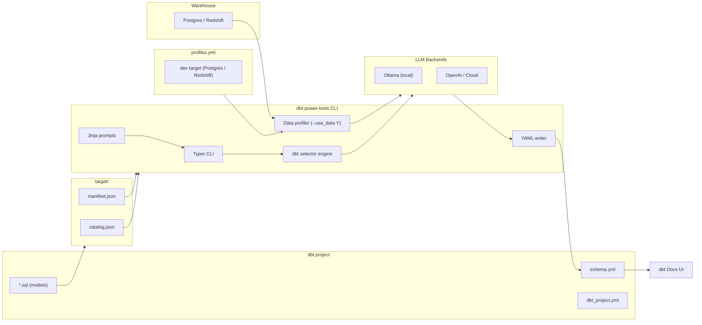

# dbt-power-tools

A powerful CLI tool that generates **LLM-powered documentation** for dbt models and columns — written directly into your `schema.yml`, ready to appear in **dbt Docs**.

It supports both **schema-only documentation** and **data-aware documentation** by profiling your warehouse data and feeding summary statistics to the LLM for enhanced accuracy.

---

# 🚀 Features

### ✅ LLM‑generated dbt documentation  
- Generates rich model & column descriptions  
- Writes directly into `schema.yml`  
- Fully dbt‑docs compatible  

### ✅ Customizable Jinja prompt templates  
Located in `<project>/prompts/`  
You can rewrite the tone, style, or structure.

### ✅ dbt-aware model selection  
Supports:  
- `--select`, `--exclude`, `--tags`  
- Glob patterns (`stg_*`, `marts.*`)  
- Parent/child expansion (`+model_name`)

### ✅ Optional data profiling (`--use_data Y`)  
When enabled:

1. Reads warehouse credentials **from profiles.yml**  
2. Runs the model’s **compiled SQL**  
3. Profiles real data (Postgres & Redshift supported today)  
4. Computes:  
   - Missing %  
   - Unique %  
   - Min / Max  
   - Mean / Std  
   - Example values  
5. LLM uses this context to produce *far higher‑quality* column docs  
6. A Markdown stats table is appended to each column description  
7. These appear in **dbt Docs → Documentation UI**

### 🔒 Local LLM supported (Ollama)  
Ensures **zero data leaves your machine**, making it suitable for sensitive environments.

---

# ⚠️ Requirement: Compiled dbt Project

Before using this tool, run:

```bash
dbt docs generate
```

Your project must contain:

- `target/manifest.json` (required)
- `target/catalog.json` (optional but recommended)
- `profiles.yml` (if using profiling mode)

---

# 🧱 Architecture Overview



---

# 🤖 Installing Ollama (Recommended)

### macOS / Linux
```bash
curl -fsSL https://ollama.com/install.sh | sh
```

Start the server:
```bash
ollama serve
```

Pull a model:
```bash
ollama pull llama3.1
```

---

# 📦 Installation (PyPI)

```bash
pip install dbt-power-tools
```

# 📦 Install from source

```bash
git clone <repo>
cd dbt-power-tools

python -m venv .venv
source .venv/bin/activate
pip install -e .
```

---

# ⚙️ Environment Variables

```bash
# Local Ollama
export OLLAMA_HOST="http://localhost:11434"
export OLLAMA_MODEL="llama3.1:8b-instruct-q8_0"
export TEMPERATURE=0.2

# (Future) Cloud LLMs
export OPENAI_BASE_URL="https://api.openai.com/v1"
export OPENAI_MODEL="gpt-4o-mini"
export OPENAI_API_KEY="sk-..."
```

---

# 🔧 Usage

### Initialize templates
```bash
dbt-tools init --project-dir .
```

### List models
```bash
dbt-tools list --project-dir . --target-dir target
```

### Generate documentation (local LLM)
```bash
dbt-tools llm-docs-generate --project-dir . --target-dir target --select dim_customers
```

### With real data profiling
```bash
dbt-tools llm-docs-generate --project-dir . --target-dir target --select dim_customers --use-data Y
```

### Use OpenAI backend
```bash
dbt-tools llm-docs-generate --project-dir . --target-dir target --backend openai
```

---

# 📘 Example of Generated Documentation


```yaml
- name: stg_products
  description: The `stg_products` model represents a staging process that 
    aggregates product information from the "products" table in the database. 
    It reads from this staging area, transforming raw product data into a 
    standardized format for analysis and reporting purposes. The main 
    transformations include standardizing product names and categories to 
    title case, converting list prices to a consistent numeric format, and 
    casting product IDs as integers. This model maintains one row per unique 
    product, providing a detailed view of each item in the catalog. Analysts 
    can use this dataset to analyze product offerings, pricing strategies, or 
    customer preferences by product category.
  columns:
    - name: product_id
      description: "The `product_id` column uniquely identifies each product in
        the database, serving as a primary key that links related data across different
        tables and models. It represents a unique identifier assigned to each product,
        allowing for efficient querying and joining of product-related information.

**Column statistics**

| Metric       | Value |
|-------------|--------|
| Missing %    | 0.0% |
| Unique %     | 100.0% |
| Min          | 10.00 |
| Max          | 13.00 |
| Mean         | 11.50 |
| Std dev      | 1.29 |
| Examples     | 10, 11, 12 |
"

    - name: product_name
      description: "The `product_name` column represents the name of a product in
        the database, capturing its descriptive label used to identify and distinguish
        it from other products.

**Column statistics**

| Metric       | Value |
|-------------|--------|
| Missing %    | 0.0% |
| Unique %     | 100.0% |
| Min          | n/a |
| Max          | n/a |
| Mean         | n/a |
| Std dev      | n/a |
| Examples     | Keyboard, Mouse, Monitor |
"

    - name: category
      description: "The `category` column represents a product's classification.

**Column statistics**

| Metric       | Value |
|-------------|--------|
| Missing %    | 0.0% |
| Unique %     | 75.0% |
| Min          | n/a |
| Max          | n/a |
| Mean         | n/a |
| Std dev      | n/a |
| Examples     | Peripherals, Display, Accessories |
"

    - name: list_price
      description: "The `list_price` column represents the product’s price.

**Column statistics**

| Metric       | Value |
|-------------|--------|
| Missing %    | 0.0% |
| Unique %     | 100.0% |
| Min          | 7.99 |
| Max          | 149.99 |
| Mean         | 50.87 |
| Std dev      | 66.71 |
| Examples     | 30.0, 15.5, 149.99 |
"
```

---

# 🛣️ Roadmap

- More warehousing support: **Snowflake, BigQuery, Databricks**
- Cache LLM responses for faster reruns
- Generate inline docs (`docs/*.md`)
- Generate lineage-aware documentation
- AI-assisted test generation
- Auto-fix missing refs & sources

---

# 📄 License

MIT © Rahul Rajasekharan  
https://www.linkedin.com/in/rahul-rajasekharan-012506121/

