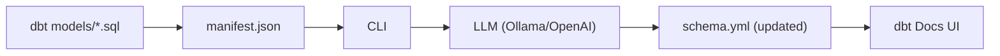

# dbt-llm-docs

A powerful CLI tool that generates **LLM-powered documentation** for dbt models and columns — automatically writing them into your `schema.yml` so they appear in **dbt Docs**.

It uses Jinja2 prompt templates and pluggable LLM backends (Ollama or OpenAI).  
Optionally, it can connect to your **actual warehouse** (Postgres & Redshift) and profile real data to give the LLM deeper context for each column.

---

## 🚀 Features

### ✅ LLM-Generated Model & Column Documentation  
Produces clear, high-quality Markdown descriptions for dbt Docs.  
Writes directly into `schema.yml`.

### ✅ Fully Customizable Prompts  
All prompts live under:

```
<project>/prompts/
```

Modify them to match your team's writing style.

### ✅ Smart dbt Selection  
Supports all common selectors:

- `--select`
- `--exclude`
- `--tags`
- Glob patterns (`stg_*`, `marts.*`)
- Parent expansion (`+model_name`)

### ✅ Data-Aware Documentation (`--use_data Y`)  
When enabled, the CLI:

1. Reads warehouse credentials from **profiles.yml**
2. Runs the model’s compiled SQL
3. Samples data
4. Computes:
   - Missing %
   - Unique %
   - Min / Max
   - Mean / Std
   - Example values
5. Sends profile summary (NOT raw data) to the LLM  
6. Appends a Markdown stats table to each column

> 🔜 **Upcoming**: Snowflake, BigQuery, Databricks support

---

## 🔒 Data Privacy Note

If you enable `--use_data Y`, only aggregated **profile summaries** (never raw data) are sent to the LLM backend.

👉 If your org forbids sending any data outside your network, use local Ollama:

```bash
dbt-tools llm-docs-generate --backend ollama
```

Ollama runs **fully offline**, ensuring no data ever leaves your machine.

---

# 🧱 Architecture Overview



---

# 📦 Install from PyPI

```bash
pip install dbt-power-tools
```

---

# 🔧 Usage

### Initialize templates

```bash
dbt-tools init --project-dir .
```

### List models

```bash
dbt-tools list --project-dir . --target-dir target
```

### Generate documentation

```bash
dbt-tools llm-docs-generate --project-dir . --target-dir target
```

---

# 📘 Example of Generated Documentation

```yaml
- name: stg_products
  description: >
    The `stg_products` model represents a staging process that aggregates product
    information from the source system. It standardizes raw product attributes such
    as names, categories, and pricing into a clean, analysis-ready structure.
```

---

# 📄 License
MIT © Rahul Rajasekharan
