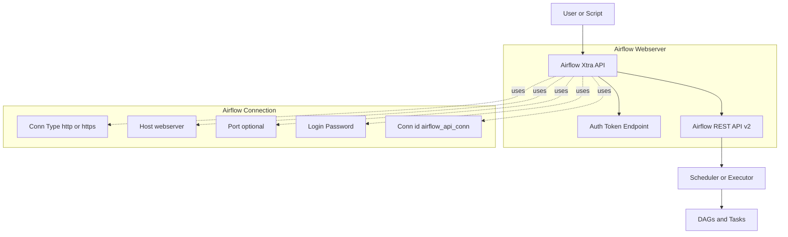
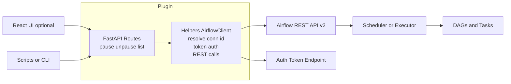

# 🧩 Bulk Pause / Unpause API Plugin

The **Bulk Pause / Unpause API** provides REST endpoints to manage DAGs programmatically — enabling bulk control over DAGs using prefix or tag-based filters.

---

## ⚙️ Overview

- Built using **FastAPI**  
- Communicates with Airflow’s **core REST API**  
- Provides endpoints to pause, unpause, or list DAGs  
- Integrated authentication via Airflow’s `/auth/token`

---

## 🔧 Features

- Centralized API client (`AirflowClient`) for REST API interaction  
- Built-in authentication support using `/auth/token`  
- Simplified connection management via Airflow’s `conn_id`  
- Consistent response formatting and error handling

---

## 📦 Installation

```bash
pip install air-labs-bulk-pause-api
```

---
## 🎥 Demo

Bulk Pause / Unpause  
👉 **[View Demo](../../demos/bulk_pause.gif)**

### Connection Setup (Required)

Before using the client, **create a connection** in the Airflow UI → *Admin → Connections*.

| Field | Description | Example |
|--------|--------------|----------|
| Conn Id | Used in code | `airflow_api_conn` |
| Conn Type | `http` or `https` | `http` |
| Host | Airflow Webserver | `http://localhost:8080` |
| Login | Username / Service Account | `admin` |
| Password | Password or API token | `mysecret` |

---


## 🧱 High-Level Architecture




## 🧩 Component View



## 🧩 Example Endpoints

| Endpoint | Method | Description |
|-----------|---------|--------------|
| `/api/airflow_bulk_pause_api/pause` | POST | Pause matching DAGs |
| `/api/airflow_bulk_pause_api/unpause` | POST | Unpause matching DAGs |
| `/api/airflow_bulk_pause_api/list` | GET | List all active DAGs |

---

## 🧪 Example Usage

```bash
curl -X POST http://localhost:8080/api/airflow_bulk_pause_api/pause -d '{"name_prefix": "etl_"}'
```

Response:

```json
{
  "paused": ["etl_orders", "etl_customers"],
  "skipped": ["daily_cleanup"]
}
```

---

## 🧱 Architecture

- FastAPI routes registered through the Airflow plugin manager  
- Uses `AirflowClient` (from helpers) for backend communication  
- Returns structured JSON responses for UI or automation scripts

---

## 🧾 License

MIT © [Rahul Rajasekharan](https://github.com/rahulrajasekharan)
